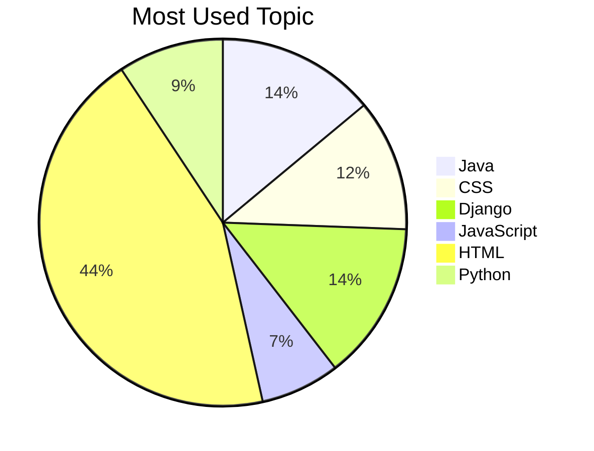
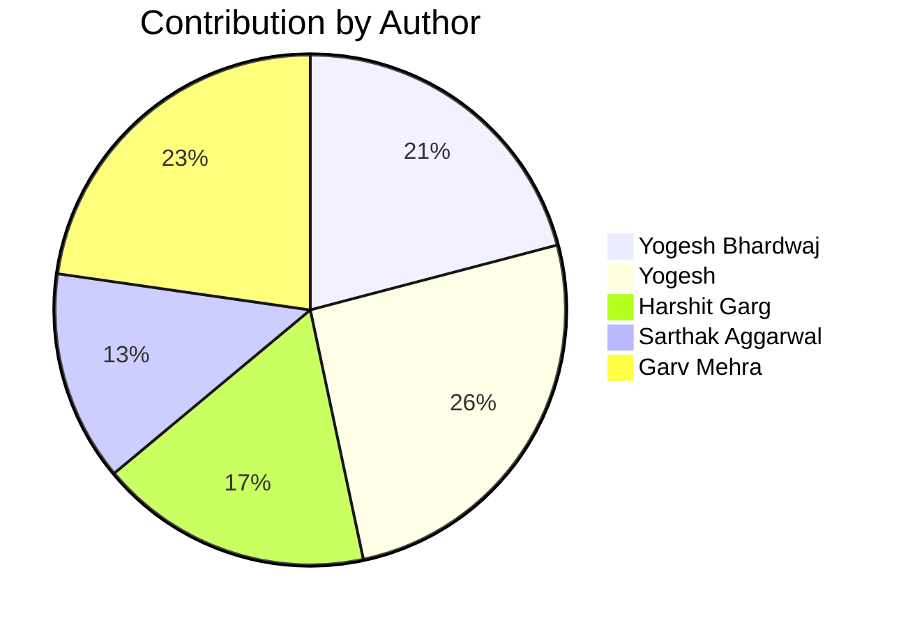

# BlogMaster Pro

Your Ultimate Blogging Platform

---

## Table of Contents

- [Project Overview](#project-overview)
- [Features](#features)
- [Tech Stack](#tech-stack)
- [Project Structure](#project-structure)
- [Setup & Installation](#setup--installation)
- [Usage](#usage)
- [Profile Page](#profile-page)
- [Blog Analytics](#blog-analytics)
- [Internationalization (Multi-language Support)](#internationalization-multi-language-support)
- [Best Practices Followed](#best-practices-followed)
- [Contributing](#contributing)
- [License](#license)

---

## Project Overview

**BlogMaster Pro** is a modern, responsive blogging platform that empowers users to create, share, and manage blogs with ease. The project demonstrates a full-stack approach, featuring a JavaScript frontend and Django and Java backend, with a focus on clean code, user experience, analytics, and professional project organization.

---

## Features

- User authentication (sign up, login, logout)
- Responsive and modern UI/UX
- Profile management (edit name, email, date of birth, age, country, city)
- Blog creation, editing, and listing
- Search and filter blogs by category
- Pagination for blogs
- Testimonials, FAQ, and contact sections
- Professional navigation and section transitions
- LocalStorage-based user/session management (for demo)
- Blog analytics dashboard (auto-generated)
- Multi-language support (English, Hindi, French)
- Theme toggle (light/dark mode)
- Clean, maintainable code and modular structure

---

## Tech Stack

- **Frontend:** HTML5, CSS3, JavaScript (Vanilla), Font Awesome, AOS (Animate On Scroll)
- **Backend:** Django (Python), Java (JPA/Hibernate)
- **Other:** LocalStorage (for demo user/session), Responsive Design, GitHub Actions for CI/CD

---

## Project Structure

```
├── index.html
├── style.css
├── script.js
├── login.js
├── profile.js
├── images/
│   └── ... (all images and avatars)
├── blogmaster_Java/
│   └── ... (Java analytics and backend code)
├── blogmaster_django/
│   └── ... (Django backend code)
├── requirements.txt
├── .gitignore
├── .github/
│   ├── workflows/
│   │   └── blog-analytics.yml
│   └── FUNDING.yml
└── README.md
```

---

## Setup & Installation

1. **Clone the Repository**
   ```sh
   git clone https://github.com/yourusername/blogmaster-pro.git
   cd blogmaster-pro
   ```

2. **Frontend (No build tools required)**
   - Open `index.html` directly in your browser.

3. **Backend (Django)**
   - Navigate to the `blogmaster_django` folder.
   - Create and activate a virtual environment:
     ```sh
     python -m venv venv
     source venv/bin/activate  # On Windows: venv\Scripts\activate
     ```
   - Install dependencies:
     ```sh
     pip install -r requirements.txt
     ```
   - Set up environment variables in a `.env` file (see `.env.example`).
   - Run migrations and start the server:
     ```sh
     python manage.py migrate
     python manage.py runserver
     ```

4. **Backend (Java)**
   - Navigate to the `blogmaster_Java` folder.
   - Build with Maven:
     ```sh
     mvn clean install
     ```
   - Run analytics or backend modules as needed.

5. **Demo Users**
   - Email: rash21@gmail.com
   - Password: 0192837465

---

## Usage

- **Login/Signup:** Use the navigation bar to log in or sign up.
- **Profile:** Click the "Profile" link in the navbar to view or edit your profile.
- **Edit Profile:** Update your name, email, date of birth, age, country, and city. Changes are saved in LocalStorage.
- **Navigate:** Use the navbar to switch between Home, About, Services, Blogs, Testimonials, FAQ, Contact, and Profile.
- **Theme Toggle:** Switch between light and dark mode using the toggle button.
- **Language Switcher:** Use the dropdown to switch between English, Hindi, and French.
- **Logout:** Use the logout button in the profile section or navbar.

---

## Profile Page

The profile page allows users to:
- View and edit their personal information (name, email, date of birth, age, country, city)
- See their registration date
- Update their details with real-time validation
- View badges, activity, and social links
- Logout securely

**Navigation:**
You can return to any other section (Home, About, etc.) using the navbar, even after entering the profile page.

---

## Blog Analytics

<!-- BLOG-ANALYTICS:START -->
# Blog Analytics Dashboard
_Last updated: Sun May  4 09:48:29 UTC 2025_

## Overview

📊 **Total Blog Posts:** 6  
📝 **Total Words:** 2317  
⏱️ **Average Reading Time:** 1 minutes

## Popular Topics


<!-- BLOG-ANALYTICS:END -->

---

## Internationalization (Multi-language Support)

- The platform supports English, Hindi, and French.
- Use the language switcher at the top to change the interface language.
- All major UI strings are translatable.
- To add more languages, update the translation files in Django and the frontend.

---

## Best Practices Followed

- **Professional Project Structure:** Clear separation of frontend and backend code.
- **.gitignore:** Sensitive and unnecessary files (e.g., `.env`, `__pycache__`, `*.pyc`, `db.sqlite3`) are excluded from version control.
- **README Documentation:** This file provides setup, usage, and contribution guidelines.
- **Responsive Design:** Works well on desktop and mobile devices.
- **Clean Code:** Modular JavaScript, semantic HTML, and organized CSS.
- **User Experience:** Friendly error messages, smooth navigation, and clear feedback.
- **Security:** No sensitive data in codebase; environment variables for secrets.
- **Accessibility:** Semantic HTML and accessible forms.
- **Continuous Integration:** Automated analytics and tests via GitHub Actions.
- **Open Source Funding:** [Sponsor this project!](https://www.buymeacoffee.com/garvmehra)

---

## Contributing

We welcome contributions! Please read our [CONTRIBUTING.md](CONTRIBUTING.md) for guidelines.

**Core Contributors:**
- Garv Mehra
- Yogesh Bhardwaj
- Sarthak Aggarwal
- Harshit Garg

<!-- CONTRIBUTION-STATS:START -->
# Contribution Statistics

## Visual Contribution Chart

[](https://github.com/studentGarv/Blog_Master_Pro/graphs/contributors)

## Contribution Breakdown



Last updated: Tue May  6 14:50:11 UTC 2025
<!-- CONTRIBUTION-STATS:END -->

---

## License

This project is licensed under the MIT License.

---

